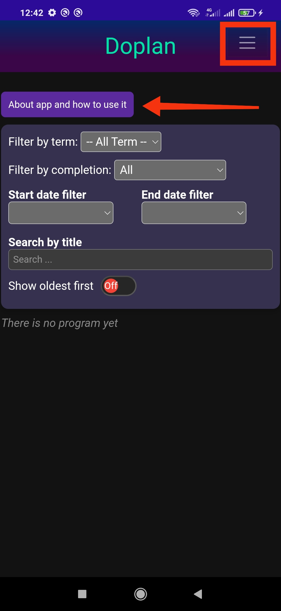
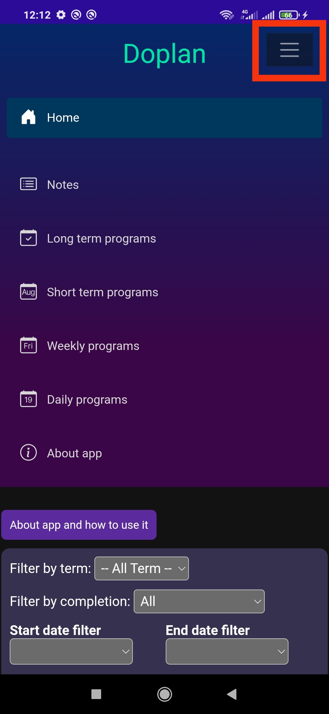
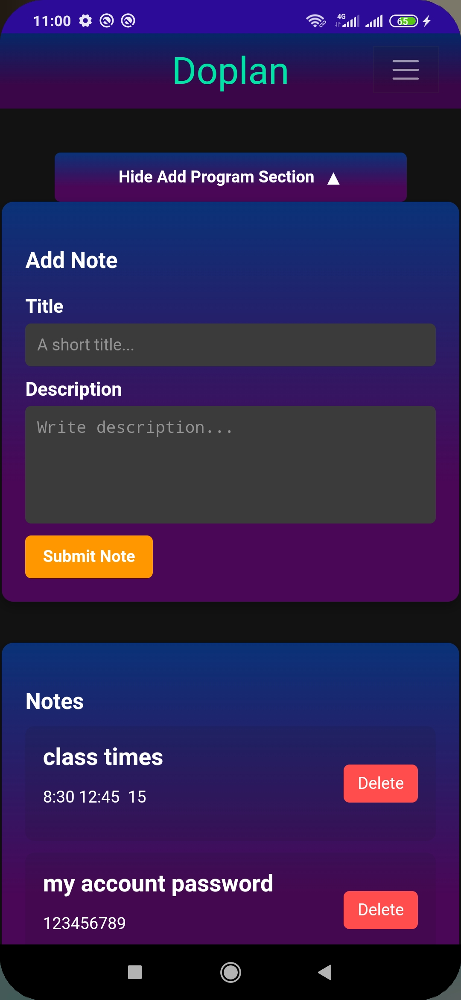
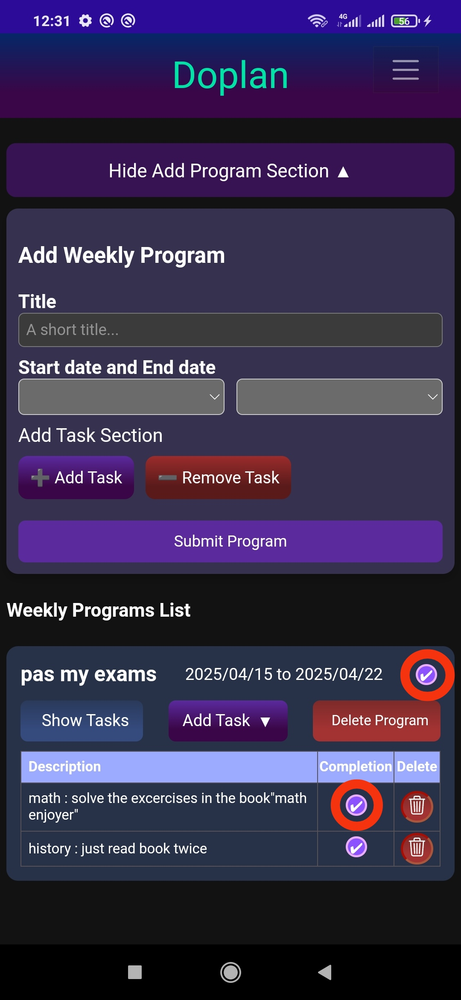
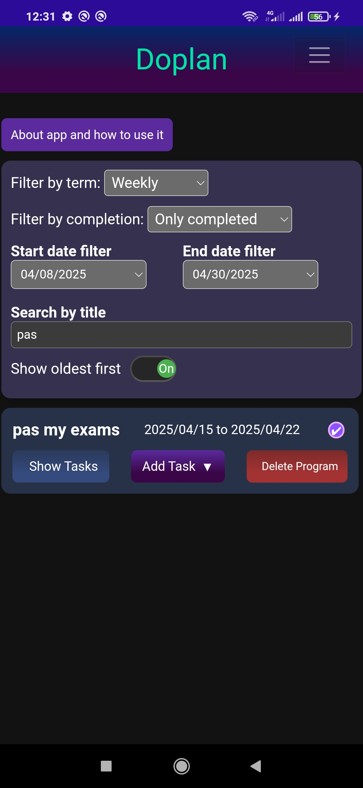

# 📋What Is Doplan?
Doplan is an app for managing your programs and tasks and making plans!

## Features
- Add, edit or delete your programs
- Programs can have types like long-term or daily programs
- You can access all of them by filter from home page
- Can add and save notes on a diffrent place 
- And thats it! you can install to explore more

## About page in app
there is a about page in the app that explain what is app and how to use it. you can install now and check it

## Some images of application environment
| Home Page | Menu | Notes | Programs Page | Filters |
|:---:|:---:|:---:|:---:|:---:|
|  |  |  |  |  |

## ⬇️Try it on android
[⬇️ Download APK](https://github.com/MPRogrammer1212/Doplan/releases/download/v1.0.1/Doplan.apk)

